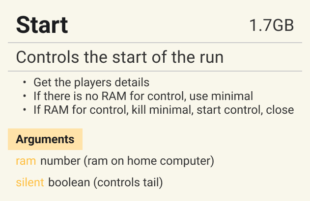

# Harooo!

Collection of scripts while trying out Bitburner

## Logic

Add image of logic flow here

### Scripts

| Script  | RAM   | Purpose                       | Arguments                                            | Methods | Logic                           |
| ------- | ----- | ----------------------------- | ---------------------------------------------------- | ------- | ------------------------------- |
| Start   | 1.7GB | Controls the start of the run | - ram (on home in GB) - silent (flag for no tail) | -       |  |
| Minimal |       |                               |                                                      |         |                                 |

---

### Resources

[Bitburner Remote File API](zRemoteAPI.md)
[Step by step install](zBeginnersGuide.md)
[Bitburner Official Github - Typescript Template for Remote API](https://github.com/bitburner-official/typescript-template)
[Bitburner Official Documentation - Remote API](https://bitburner-official.readthedocs.io/en/latest/remoteapi.html)
[Bitburner Official Documentation - Netscript](https://bitburner-official.readthedocs.io/en/latest/netscript.html)
[Bitburner Official Github - Netscript Interface](https://github.com/bitburner-official/bitburner-src/blob/dev/markdown/bitburner.ns.md)

### Credit

- Code in src is original
- Remote API and wrapper thanks to the [Typescript Template repo](https://bitburner-official.readthedocs.io/en/latest/remoteapi.html) and hydroflame, Hoekstraa, based on work by SlyCedix
- Minimal.js borrows from [Official Getting Started Guide](https://bitburner-official.readthedocs.io/en/latest/guidesandtips/gettingstartedguideforbeginnerprogrammers.html)
- Hacknet payback time borrows from [@grimley517](https://gist.github.com/grimley517/c2d531976db057cede4ac8e367418971)
- HWGW Algorithm borrows from [@trhr](https://github.com/trhr/lets-play-bitburner/blob/ep7/hwgw.js)
